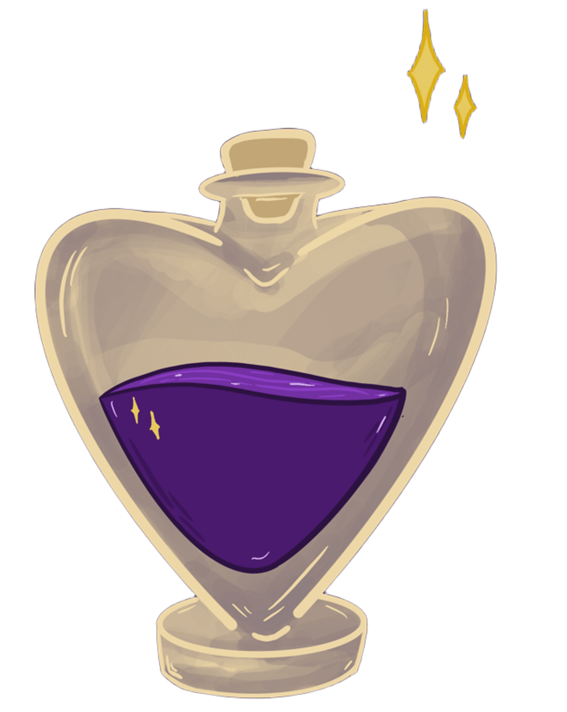

 

<h1 align="center">ArteFairy</h1>

O **ArteFairy** é um e-commerce temático fictício que simula a venda de artefatos inspirados em diferentes universos da cultura pop, como filmes, séries e jogos.  

Entre os produtos disponíveis estão itens como:  
- 🍎 **Maçã Dourada** do Minecraft  
- ⚡ **Varinha das Varinhas** de Harry Potter   
- 🔴 **Pokébola** do Ash de Pokémon  
- 🗡️ **Sabre de Luz** do Luke de Star Wars

Desenvolvido como trabalho final da disciplina de Front End Essencial, o projeto aplica conceitos de **HTML**, **CSS**, **JavaScript** e **Bootstrap**, com foco em boas práticas de desenvolvimento web e uso de **API** para simular funcionalidades reais de um site de comércio eletrônico.

## 👩‍💻 **Contribuidoras**

| Nome      | Contribuição | GitHub |
|-----------|--------------|--------|
| **Dandara** | Página de Perfil | [@dandara](https://github.com/dandaralimaf) |
| **Lívia**   | Página Home | [@livia](https://github.com/livia9) |
| **Maria**   | Carrinho de Compras e Página de Produtos | [@maria](https://github.com/Maria-S-Aragao) |
| **Rayca**   | Sistema de Login/Cadastro | [@rayca](https://github.com/raycaThais) |
| **Sabrina** | Catálogo, Exposição de Animes e Logo do E-commerce | [@sabrina](https://github.com/Sai-czs) |
